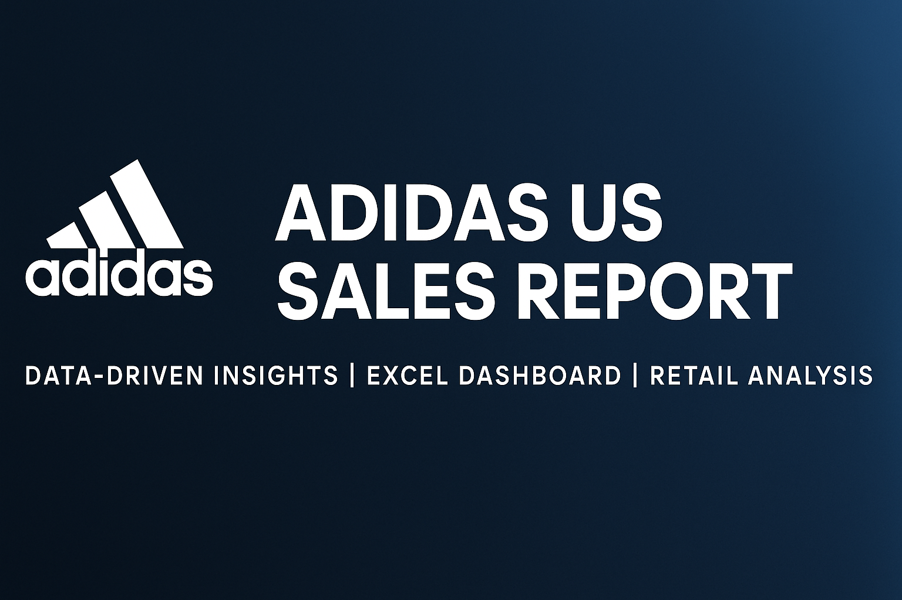
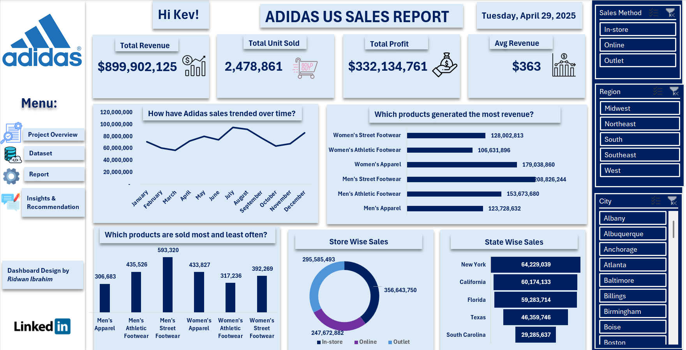

# 📊 Adidas US Sales Analysis Dashboard (Excel)


 

## 🧠 Project Overview
Adidas, a global leader in sportswear, sought to understand its U.S. sales performance to identify high-performing product categories, regional strengths, and sales trends. This Excel dashboard was created to answer critical business questions using clean visualizations and key performance indicators (KPIs).

## 📌 Query: Top 10 Customers by Total Spend

This SQL query returns the top 10 customers based on their total spending from the `orders` table.

```sql
-- Get top 10 customers by total spend
SELECT customer_id, SUM(amount) AS total_spend
FROM orders
GROUP BY customer_id
ORDER BY total_spend DESC
LIMIT 10;
```

## 🎯 Business Problem
The U.S. sales team at Adidas needed a report to:
- Measure total revenue, units sold, and profit across multiple dimensions.
- Understand monthly sales patterns and seasonality.
- Identify top-performing and underperforming product types.
- Evaluate sales performance by region, state, and city.
- Compare store-type contributions (In-store, Online, Outlet).

## 📌 Business Questions Answered
- What is the total revenue, profit, and average revenue per unit?
- How do sales trend over time (monthly)?
- Which product categories drive the most revenue and unit sales?
- How are sales distributed across store types?
- Which U.S. states and cities contribute the most to total revenue?

## 📈 Key Insights
- Women's Street Footwear generated the highest revenue ($208M).
- Men's Street Footwear had the highest unit sales (593K units).
- August showed a significant sales peak—likely due to seasonal campaigns.
- In-store sales accounted for the largest share of revenue.
- New York and California were the top-performing states.

## 💡 Recommendations
- Double down on inventory and marketing for high-revenue categories.
- Re-evaluate product lines with poor sales performance.
- Plan future campaigns around the August sales spike.
- Strengthen digital and physical store synergy.
- Explore growth opportunities in lower-performing regions.

## 🛠 Tools Used
- Microsoft Excel
- Pivot Tables
- Slicers
- Charts & KPIs
- Dashboard Design Principles

## 🖱️ Interact with the Dashboard Online
👉 [Click here to view and interact with the Adidas Excel Dashboard on OneDrive](https://1drv.ms/x/c/cbc72564bad1f538/EVNi228AiP5PjD9Ztc2yDMsBd5vlMF-IJSFdqIgO8-Kp3Q?e=hINacG)

*Note: Best viewed on desktop using Microsoft Excel Online.*

## 📊 Dashboard Preview



## 💰 Want to Learn This?
Learn how to create professional dashboards like this from scratch.  
Join the course on Excel for Data Analysis at Datasage Academy.  
👉 [Join our WhatsApp Community](https://wa.me/2347066455201)
